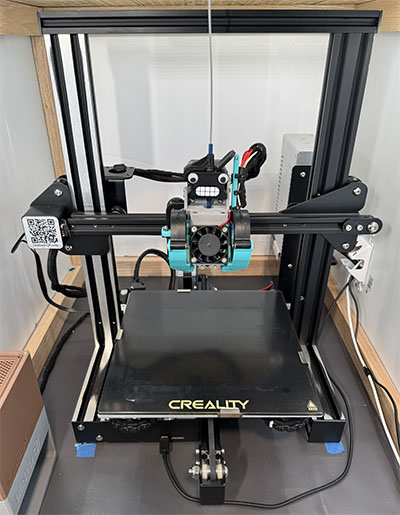

# Klipperized Foxnova Ender3 Clone

## Hardware
- Foxnova Ender3 kit
- Stock Creality steppers
- Creality Spider Pro 3.0 hotend
- [Hero Me Gen7 printhead, dual 5015 fans](https://www.merlinmedia.com/)
- Creality Sprite direct drive extruder
- BIGTREETECH SKR MINI E3 V3.0
- Rapsberry Pi3 and 5" LCD touchscreen
- Bento Box connected to the MCU fan header
- Custom sealed enclosure

## Software
- Klipper
- Orca Slicer

## Dependencies
- [Klipper-Adaptive-Mesh-Purging](https://github.com/kyleisah/Klipper-Adaptive-Meshing-Purging)
